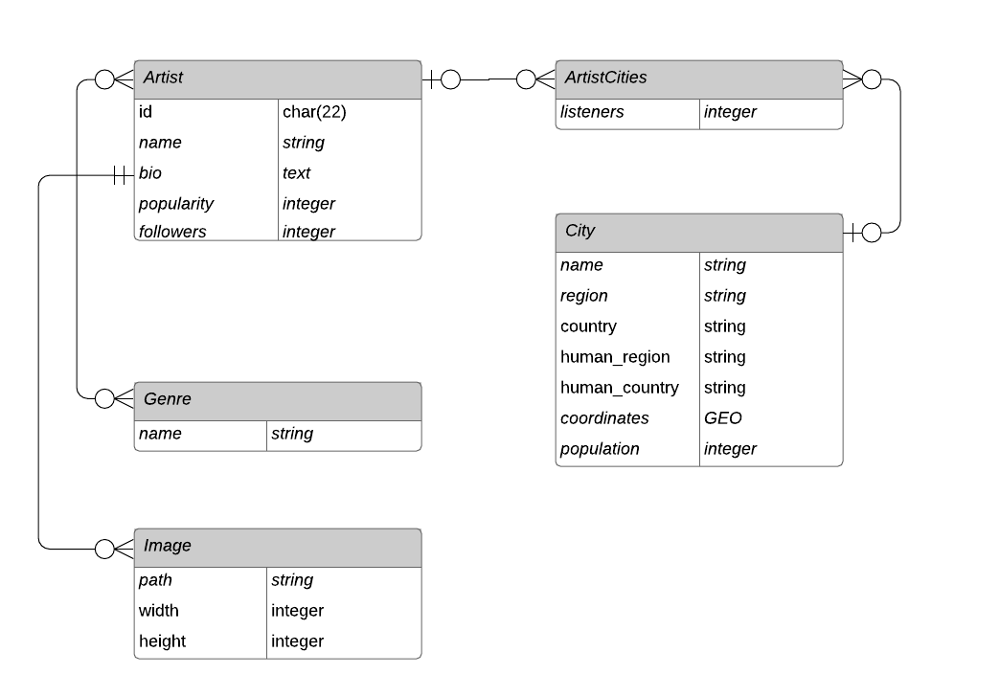

# Disco Planet | Project of Data Visualization (COM-480)

| Student's name | SCIPER |
| -------------- | ------ |
| Aleksei Kashuba| 298846 |
| Ivan Yurov | 292453 |
| Ekaterina Svikhnushina | 292820 |

[Milestone 1](#milestone-1-friday-3rd-april-5pm) • [Milestone 2](#milestone-2-friday-1st-may-5pm) • [Milestone 3](#milestone-3-thursday-28th-may-5pm)

## Milestone 1 (Friday 3rd April, 5pm)
**10% of the final grade**

### Dataset
We retrieved our main dataset using the [Spotify API](https://developer.spotify.com/documentation/web-api/). The dataset contains information about artists’ popularity in cities of the world. In particular it shows the top 50 cities in which people listen to the artist as well as the number of listeners. We would like to visualize this data on a map. To that end we have collected data about the coordinates of the cities in the main dataset ([World Cities Database](https://simplemaps.com/data/world-cities)). Additionally, we have collected the [information](https://public.opendatasoft.com/explore/dataset/worldcitiespop/information/?disjunctive.country&sort=population&q=Newtownabbey&location=22,51,4.13333&basemap=jawg.streets)  about the population of each city in order to be able to normalize listener counts. We don’t expect any errors in the main dataset collected from Spotify. The data about the location and the population count may contain some inaccuracies but the quality should be sufficient for the purposes of our visualizations. The entity-relationship diagram of our database is illustrated below:

Most of the data-cleaning was handled during the database construction phase. Currently we have a large number (see [Exploratory Data Analysis](#exploratory-data-analysis)) of various music genres in the dataset. We plan to reduce them to a reasonable amount employing clusterization or some other approaches. Additionally, we will need to come up with a metric to measure similarity between the cities based on prevailing music genres and popular artists. This should be a relatively easy task to handle.

### Problematic

The modern world offers us almost unlimited oppotrunities to choose products,
services, and way of life. Apparently, this abundance of alternatives may lead to
detrimental consequences to our psychological and emotional well-being [(Schwartz, 2004)](#Schwartz-2004). Frequent situation causing many of us to struggle occurs
when we try to pick a new travel destination. Luckily, according to the researchers,
narrowing the variety of options can remarkably relieve stress and axiety
imposed by choice overload [(Schwartz, 2004)](#Schwartz-2004).

While there are many factors influencing attractiveness of travel destinations for
tourists [(Sirgy, 2000)](#Sirgy-2000), we are confident that _music_ can effectively
mediate people's experience of a particular city or area of interest. Many of us have
subtle musical preferences, which closely relate to our personalities [(Greenberg, 2016)](#Greenberg-2016). Curiously, it is also possible to apply the concept of
personality to a place or city [(Demirbag, 2010)](#Demirbag-2010). The greater it
corresponds to our own personal traits, the more likely we develop a positive attitude
towards the desination [(Sirgy, 2000)](#Sirgy-2000). By building music profiles of
various cities based on their population's preferences we can provide a tool for
music-lovers to target their exploration of numerous vacation spots to presumably
more favorable options.

In a nutshell, the ideas above bring us to the following problem statement:

> Music-lovers puzzling over choices for their next vacation destination need a way to guide their search based on music profiles of the cities because musical preferences are linked to personality and when the destination personality matches our own, we are more likely to enjoy the visit.

### Exploratory Data Analysis
**TODO**

Cities by Spotify usage:

`
SELECT city,
       Sum(listeners) AS total_listeners
FROM   artist_cities
       JOIN cities
         ON cities.id = artist_cities.city_id
GROUP  BY city
ORDER  BY total_listeners DESC
LIMIT  20;  
`

      city      | total_listeners
----------------+-----------------
 Mexico City    |       477295795
 Santiago       |       435246290
 São Paulo      |       387313610
 Chicago        |       326904875
 Los Angeles    |       317947775
 Dallas         |       268225888
 Sydney         |       265424569
 Houston        |       218524318
 Paris          |       217417758
 Buenos Aires   |       201818091
 Amsterdam      |       200299460
 Madrid         |       196943653
 Guadalajara    |       195691536
 Atlanta        |       195318586
 Jakarta        |       191214883
 Brisbane       |       185219075
 Toronto        |       181832911
 Melbourne      |       181786450
 Rio de Janeiro |       179854953
 London         |       174880641
(20 rows)

Cities by Spotify usage normalized by population:

`
 SELECT   city,
         Sum(listeners)/population AS total_listeners
FROM     artist_cities
JOIN     cities
ON       cities.id=artist_cities.city_id
GROUP BY city,
         population
ORDER BY total_listener s DESC limit 20; 
`
     city      | total_listeners
---------------+-----------------
 Puebla        |            7534
 San Miguel    |            4960
 San Juan      |            3602
 Quezon        |            2944
 Tlalnepantla  |            1938
 Frederiksberg |             788
 Santa Rosa    |             549
 Elkridge      |             449
 Gehrden       |             237
 Bulacan       |             202
 Amsterdam     |             194
 Adlaon        |             156
 Oslo          |             155
 Calamba       |             149
 Anaheim       |             146
 Arlington     |             144
 Zurich        |             134
 Saint-Max     |             132
 Stockholm     |             124
 Münster       |             121

Cities that most often appear in top 50 for artists:
`
SELECT city,
       Count(*) AS in_top_50
FROM   artist_cities
       JOIN cities
         ON cities.id = artist_cities.city_id
GROUP  BY city
ORDER  BY in_top_50 DESC
LIMIT  20;  
`
     city      | in_top_50
---------------+-----------
 Los Angeles   |     24129
 Chicago       |     23686
 Sydney        |     23021
 Toronto       |     22793
 London        |     21501
 Dallas        |     21439
 Melbourne     |     21344
 Houston       |     21228
 San Francisco |     20436
 Brisbane      |     20239
 Montreal      |     20051
 Seattle       |     19909
 Amsterdam     |     19598
 Mexico City   |     19571
 Santiago      |     19524
 Atlanta       |     19391
 Brooklyn      |     19207
 Paris         |     18139
 Stockholm     |     17961
 Berlin        |     16919

Artists with most listeners in their top 50 cities (proxy for most popular artists):
`
SELECT name,
       Sum(listeners) AS total_listeners
FROM   artist_cities
       JOIN artists
         ON artist_cities.artist_id = artists.id
GROUP  BY name
ORDER  BY total_listeners DESC
LIMIT  20;  
`

      name      | total_listeners
----------------+-----------------
 J Balvin       |        24792577
 Justin Bieber  |        23257678
 Bad Bunny      |        22819988
 The Weeknd     |        21361869
 Daddy Yankee   |        20311296
 Ed Sheeran     |        20210593
 Billie Eilish  |        19962808
 Drake          |        19346899
 Dua Lipa       |        19264039
 Post Malone    |        18856668
 Khalid         |        18615167
 Nicki Minaj    |        18492683
 Camila Cabello |        17498151
 Anuel AA       |        17486063
 Ozuna          |        16991164
 Sech           |        16951666
 Maroon 5       |        16704370
 Tones And I    |        16382249
 KAROL G        |        16247916
 Halsey         |        15631702

Proxy for most popular genres:
`
 SELECT   genres.NAME,
         Sum(listeners) AS total_listeners
FROM     artist_cities
JOIN     artists
ON       artist_cities.artist_id=artists.id
JOIN     artist_genres
ON       artist_genres.artist_id=art ists.id
JOIN     genres
ON       genres.id=genre_id
GROUP BY genres.NAME
ORDER BY total_listeners DESC limit 30; 
`
        name        | total_listeners
--------------------+-----------------
 pop                |      1833385358
 dance pop          |      1191221938
 latin              |       992892784
 rap                |       812596658
 post-teen pop      |       788187051
 pop rap            |       786859077
 rock               |       643883032
 reggaeton          |       585994405
 hip hop            |       561785934
 latin pop          |       516769383
 edm                |       510271573
 tropical house     |       500519887
 trap               |       488552642
 tropical           |       431984374
 pop rock           |       352137183
 modern rock        |       340109982
 southern hip hop   |       318662212
 electropop         |       316466779
 electro house      |       306481455
 reggaeton flow     |       286776651
 soft rock          |       280984603
 mellow gold        |       276945122
 classic rock       |       270106770
 funk carioca       |       266649907
 album rock         |       262541874
 r&b                |       258093407
 urban contemporary |       255939179
 latin hip hop      |       251545237
 rock en espanol    |       232762019
 indie pop          |       228521573

Proxy for most popular genres in Lausanne:

`
 SELECT   genres.NAME,
         Sum(listeners) AS total_listeners
FROM     artist_cities
JOIN     cities
ON       cities.id=artist_cities.city_id
JOIN     artists
ON       artist_cities.artist_id=artists.id jo IN artist_genres
ON       artist_genres.artist_id=artists.id
JOIN     genres
ON       genres.id=genre_id
WHERE    city='Lausanne'
GROUP BY genres.NAME
ORDER BY total_listeners DESC limit 30; 
`

            name            | total_listeners
----------------------------+-----------------
 french hip hop             |         1640878
 pop urbaine                |         1417919
 rap francais               |          890962
 french pop                 |          640587
 francoton                  |          609597
 german hip hop             |          529343
 rap conscient              |          449738
 chanson                    |          441105
 german pop                 |          311419
 nouvelle chanson francaise |          290924
 french indie pop           |          278462
 french rock                |          272639
 french indietronica        |          188641
 new french touch           |          179533
 rap calme                  |          160613
 rap marseille              |          155106
 deep german hip hop        |          120659
 variete francaise          |          115900
 belgian hip hop            |          109542
 french reggae              |          104419
 albanian hip hop           |          100913
 tropical house             |           96774
 german rock                |           89102
 partyschlager              |           82806
 german cloud rap           |           79011
 albanian pop               |           77087
 kosovan pop                |           64182
 turbo folk                 |           59789
 ye ye                      |           52769
 rap algerien               |           51715

### Related work
- What others have already done with the data?
  - We collected the dataset by ourselves, so it is unique in this sense. Since the data
mostly come from Spotify, service developers might have used it for related projects. We
didn't find any interactive visualizations authored by Spotify team and addressing the
same user needs as indicated in [Problematic section](#problematic). The only somewhat
related visualization from Spotify is listed below as a source of inspiration.

- Why is your approach original?
  - Even though several attempts to visualize music profiles of cities were discussed
in literature [[(Hauger, 2016)](#Hauger-2016), [(Mellander, 2018)](#Mellander-2018)], to the
best of our knowledge no working solution exists. More importantly, nobody has ever
considered this problem from the perspective of the traveller searching for a new
vacation spot. We consider it to be a crusial factor for consideration in order to
design useful and easy to use application.

- What source of inspiration do you take?
  - Inspiration for visualization:
    -  Hauger, D., Schedl, M., 2016. Music Tweet Map: A browsing interface to explore the microblogosphere of music, in: 2016 14th International Workshop on Content-Based Multimedia Indexing (CBMI). Presented at the 2016 14th International Workshop on Content-Based Multimedia Indexing (CBMI), IEEE, Bucharest, Romania, pp. 1–4. https://doi.org/10.1109/CBMI.2016.7500277
    - [Music Tweet Map](http://www.cp.jku.at/projects/MusicTweetMap/)
    - [The one million tweet map](https://onemilliontweetmap.com/)
    - [What Type of Music Is Your City Most Passionate About?](https://time.com/37332/music-preference-maps/)
    - [Hoodmaps](https://hoodmaps.com/)
    -  Mellander, C., Florida, R., Rentfrow, P.J., Potter, J., 2018. The geography of music preferences. J Cult Econ 42, 593–618. https://doi.org/10.1007/s10824-018-9320-x
  - Other resources and references:
    - [Every Noise at Once](http://everynoise.com/)
    -  Schwartz, B., 2004, January. The paradox of choice: Why more is less. New York: Ecco.
    -  Sirgy, M.J., Su, C., 2000. Destination Image, Self-Congruity, and Travel Behavior: Toward an Integrative Model. Journal of Travel Research 38, 340–352. https://doi.org/10.1177/004728750003800402
    -  Greenberg, D.M., Kosinski, M., Stillwell, D.J., Monteiro, B.L., Levitin, D.J., Rentfrow, P.J., 2016. The Song Is You: Preferences for Musical Attribute Dimensions Reflect Personality. Social Psychological and Personality Science 7, 597–605. https://doi.org/10.1177/1948550616641473
    -  Demirbag, K.M., Yurt, O., Guneri, B., Kurtulus, K., 2010. Branding places: applying brand personality concept to cities. European Journal of Marketing 44, 1286–1304. https://doi.org/10.1108/03090561011062844

- This is the first project for which we use our dataset.

## Milestone 2 (Friday 1st May, 5pm)

**10% of the final grade**

## Milestone 3 (Thursday 28th May, 5pm)

**80% of the final grade**
