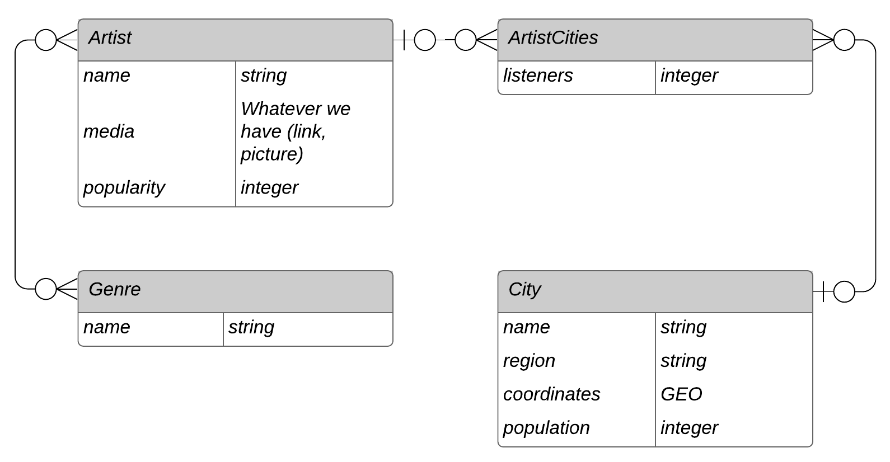

# Disco Planet | Project of Data Visualization (COM-480)

| Student's name | SCIPER |
| -------------- | ------ |
| Aleksei Kashuba| 298846 |
| Ivan Yurov | 292453 |
| Ekaterina Svikhnushina | 292820 |

[Milestone 1](#milestone-1-friday-3rd-april-5pm) • [Milestone 2](#milestone-2-friday-1st-may-5pm) • [Milestone 3](#milestone-3-thursday-28th-may-5pm)

## Milestone 1 (Friday 3rd April, 5pm)
**10% of the final grade**

### Dataset

We retrieved our main dataset using the [Spotify API](https://developer.spotify.com/documentation/web-api/). The dataset contains information about artists’ popularity in the cities of the world. In particular, it shows the top 50 cities in which people listen to the given artist as well as the number of listeners. We would like to visualize this data on a map. To that end, for each city in the main dataset, we retrieved geographical coordinates from the [World Cities Database](https://simplemaps.com/data/world-cities). Additionally, we collected the population information of each city from the [World Cities Population dataset](https://public.opendatasoft.com/explore/dataset/worldcitiespop/information/?disjunctive.country&sort=population&q=Newtownabbey&location=22,51,4.13333&basemap=jawg.streets) in order to be able to normalize the listener counts. We don’t expect any errors in the main dataset collected from Spotify. The data about the location and the population count may contain some inaccuracies but the quality should be sufficient for the purposes of our visualizations. The entity-relationship diagram of our database is illustrated below



Most of the data-cleaning was handled during the database construction phase. Currently we have a large number (see [Exploratory Data Analysis](#exploratory-data-analysis)) of various music genres in the dataset. We plan to reduce them to a reasonable amount employing clusterization or some other approaches. Additionally, we will need to come up with a metric to measure similarity between the cities based on prevailing music genres and popular artists. This should be a relatively easy task to handle.


### Problematic

Modern means of communication and transportation have made traveling much easier. More and more people relocate abroad for work, relationships, or other reasons, rising the total count of foreign-born population to the impressive [300 million worldwide](https://publications.iom.int/system/files/pdf/wmr_2020.pdf). With many cities turning into melting pots, cultural, social and personal motives [drive people’s curiosity](https://comms.theculturetrip.com/wp-content/uploads/2019/05/Culture-Trip-Beyond-Borders-May-2019-Final.pdf) to explore how diverse backgrounds and experiences of different corners of the world intertwine and blur geographical borders. As [music plays a central role in cultural identity](https://doi.org/10.1007/s10824-018-9320-x), our project strives to provide these insights by looking into musical preferences of people around the globe.

We would like to explore multiple ways in which this can be achieved. First, we plan to overlay the geographical map with the  color-coded information about music genre popularity. Another part of the project concerns visualizing genre profiles for each city. To develop this idea further, we can create a lower-dimensional embedding space for city profiles to cluster cities with similar musical preferences. Finally, to bring the interactivity of our visualization to the next level, we consider querying Spotify about the user's favorite artists and showing the cities aligning with their musical tastes.


### Exploratory Data Analysis
Simple statistics about the data:

| artists | cities | genres | 
|---------|--------|--------| 
| 32923   | 3277   | 3823   | 


Cities by Spotify usage:

```
SELECT city,
       Sum(listeners) AS total_listeners
FROM   artist_cities
       JOIN cities
         ON cities.id = artist_cities.city_id
GROUP  BY city
ORDER  BY total_listeners DESC
LIMIT  10;  
```

|     city     | total_listeners|
|--------------|----------------|
| Mexico City  |       418013817|
| Santiago     |       378280299|
| São Paulo    |       340642646|
| Chicago      |       278866062|
| Los Angeles  |       270153240|
| Dallas       |       228789729|
| Sydney       |       228039225|
| Houston      |       186436834|
| Paris        |       183979818|
| Buenos Aires |       175351209|


Cities by Spotify usage normalized by population:

```
SELECT   city,
         Sum(listeners)/population AS normalized_listeners, population
FROM     artist_cities
JOIN     cities
ON       cities.id=artist_cities.city_id
GROUP BY city,
         population
ORDER BY normalized_listeners DESC limit 10;
```
|     city      | normalized_listeners | population|
|---------------|----------------------|-----------|
| Frederiksberg |                  645 |       3142|
| San Juan      |                  415 |      15416|
| Elkridge      |                  386 |      19367|
| Quezon        |                  297 |      18451|
| Gehrden       |                  217 |      15139|
| Bulacan       |                  178 |       4518|
| Amsterdam     |                  166 |    1031000|
| Adlaon        |                  140 |       3647|
| San Miguel    |                  133 |      65661|
| Oslo          |                  130 |     835000|

Note: we can see that some errors inevitably crept into out population data.
(Frederiksberg's real population count is closer to 100'000)
However, we don't expect this to be a major problem.

Cities that most often appear in top 50 for artists:
```
SELECT city,
       Count(*) AS in_top_50
FROM   artist_cities
       JOIN cities
         ON cities.id = artist_cities.city_id
GROUP  BY city
ORDER  BY in_top_50 DESC
LIMIT  10;  
```
|     city      | in_top_50|
|---------------|----------|
| Los Angeles   |     17521|
| Chicago       |     17180|
| Sydney        |     16717|
| Toronto       |     16537|
| Dallas        |     15607|
| London        |     15583|
| Melbourne     |     15518|
| Houston       |     15469|
| San Francisco |     14768|
| Brisbane      |     14748|

Artists with most listeners in their top 50 cities (proxy for most popular artists):
```
SELECT name,
       Sum(listeners) AS total_listeners
FROM   artist_cities
       JOIN artists
         ON artist_cities.artist_id = artists.id
GROUP  BY name
ORDER  BY total_listeners DESC
LIMIT  10;
```
|     name      | total_listeners|
|---------------|----------------|
| J Balvin      |        24792577|
| Justin Bieber |        23257678|
| Bad Bunny     |        22819988|
| The Weeknd    |        21361869|
| Daddy Yankee  |        20311296|
| Ed Sheeran    |        20210593|
| Billie Eilish |        19962808|
| Drake         |        19346899|
| Dua Lipa      |        19264039|
| Post Malone   |        18856668|

Artists by monthly listeners:

```
SELECT name,
       popularity,
       monthly_listeners
FROM   artists
ORDER  BY popularity DESC
LIMIT  10; 
```

|     name      | popularity | monthly_listeners|
|---------------|------------|------------------|
| Bad Bunny     |        100 |          44940166|
| Lil Uzi Vert  |         96 |          25691736|
| Justin Bieber |         96 |          63010229|
| J Balvin      |         96 |          54760349|
| Drake         |         96 |          48631727|
| Post Malone   |         95 |          52179881|
| Billie Eilish |         95 |          56725215|
| The Weeknd    |         94 |          56971820|
| BTS           |         94 |          20325658|
| Juice WRLD    |         94 |          28604023|

Note: we can see that the proxy that we used previously seems to provide a meaningful signal about artist popularity.
Next we will use a similar proxy to find out the most popular genres.

Proxy for most popular genres:
```
SELECT   genres.NAME,
         Sum(listeners) AS total_listeners
FROM     artist_cities
JOIN     artists
ON       artist_cities.artist_id=artists.id
JOIN     artist_genres
ON       artist_genres.artist_id=artists.id
JOIN     genres
ON       genres.id=genre_id
GROUP BY genres.NAME
ORDER BY total_listeners DESC limit 10; 
```
|        name        | total_listeners|
|--------------------|----------------|
| pop                |      1833385358|
| dance pop          |      1191221938|
| latin              |       992892784|
| rap                |       812596658|
| post-teen pop      |       788187051|
| pop rap            |       786859077|
| rock               |       643883032|
| reggaeton          |       585994405|
| hip hop            |       561785934|
| latin pop          |       516769383|

Proxy for most popular genres in Lausanne:

```
SELECT   genres.NAME,
         Sum(listeners) AS total_listeners
FROM     artist_cities
JOIN     cities
ON       cities.id=artist_cities.city_id
JOIN     artists
ON       artist_cities.artist_id=artists.id
JOIN 	 artist_genres
ON       artist_genres.artist_id=artists.id
JOIN     genres
ON       genres.id=genre_id
WHERE    city='Lausanne'
GROUP BY genres.NAME
ORDER BY total_listeners DESC limit 10; 
```
|            name            | total_listeners|
|----------------------------|----------------|
| french hip hop             |         1640878|
| pop urbaine                |         1417919|
| rap francais               |          890962|
| french pop                 |          640587|
| francoton                  |          609597|
| german hip hop             |          529343|
| rap conscient              |          449738|
| chanson                    |          441105|
| german pop                 |          311419|
| nouvelle chanson francaise |          290924|

### Related work
- What others have already done with the data?
  - We collected the dataset by ourselves, so it is unique in this sense. Since the data mostly come from Spotify, service developers might have used it for related projects. We didn't find any interactive visualizations authored by Spotify team and addressing the same ideas as indicated in [Problematic section](#problematic). The only somewhat related visualization from Spotify is listed below as a source of inspiration.


- Why is your approach original?
  - Most importantly, originality of our approach results from the way how we collected the dataset. Some previous works analysed people's musical prefernces based on [location-based BitTorrent traffic](https://time.com/37332/music-preference-maps/), [geo-tagged listening events mined from Twitter](https://doi.org/10.1109/CBMI.2016.7500277), and [listening events of Last.fm](http://link.springer.com/10.1007/s13735-017-0118-y), a music recommender service. Given that in 2019 [Spotify ranked No. 1](https://www.fipp.com/news/insightnews/chart-week-world-most-popular-music-streaming-services) in the list of most popular music streaming services in the world, we expect Spotify's data to be the most insightful and representative.
  - Even though several research works investigated music profiles of [cities](https://doi.org/10.1109/CBMI.2016.7500277), [georaphical regions](https://doi.org/10.1007/s10824-018-9320-x), and [countries](http://link.springer.com/10.1007/s13735-017-0118-y), to the best of our knowledge no working online visualization of this phenomenon exists. Moreover, none of the offline prototypes that we saw (e.g. [Music Tweet Map](http://www.cp.jku.at/projects/MusicTweetMap/)) represents city profiles with such granularity as we aim to, neither provides easily interpretable by the users search and naviation panel.


- What source of inspiration do you take?
  - Inspiration for visualization:
    - [Hauger et. al, 2016](https://doi.org/10.1109/CBMI.2016.7500277). Music Tweet Map: A browsing interface to explore the microblogosphere of music.
    - [Schedl, 2017](https://link.springer.com/article/10.1007%2Fs13735-017-0118-y). Investigating country-specific music preferences and music recommendation algorithms with the LFM-1b dataset.
    - [Mellander et. al, 2018](https://doi.org/10.1007/s10824-018-9320-x). The geography of music preferences.
    - [Music Tweet Map](http://www.cp.jku.at/projects/MusicTweetMap/)
    - [The one million tweet map](https://onemilliontweetmap.com/)
    - [What Type of Music Is Your City Most Passionate About?](https://time.com/37332/music-preference-maps/)
    - [Hoodmaps](https://hoodmaps.com/)
    - [Every Noise at Once](http://everynoise.com/)


- This is the first project for which we use our dataset.

## Milestone 2 (Friday 1st May, 5pm)

**10% of the final grade**

### Two A4 pages describing the project goal
Our [report](https://github.com/com-480-data-visualization/com-480-project-datavvizards/blob/master/milestone2_report.pdf) is available in the root folder of this repository.

### Functional project prototype review
Our project prototype can be accessed by the [link](http://ec2-34-252-224-152.eu-west-1.compute.amazonaws.com/dashboard).


## Milestone 3 (Thursday 28th May, 5pm)

**80% of the final grade**
